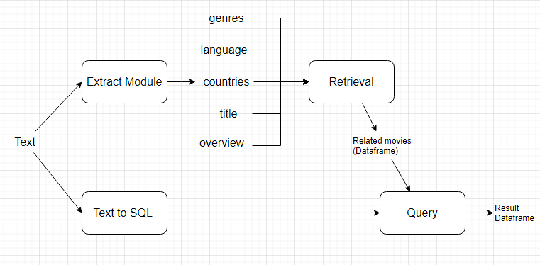

## 1. Processing Pipeline:



Step 1: Translate the movie search text into English using GPT-4.0.

Step 2: Use GPT-3.5 to extract categorical fields including genre, language, countries, as well as the movie's description and title.

Step 3: Use the fields obtained in Step 2 to find related movies.

Step 4: Create SQL queries for the budget and revenue fields, as these are continuous data fields and cannot be extracted as categories. For example: “top 10 bộ phim có doanh thu cao nhất ở việt nam"

Step 5: Use the SQL query from Step 4, if applicable, to query the table created in Step 3.

## 2. Future improvements.
- Replace the Retrieval module by retraining large language models such as Llama-2 or Flan-T5 to reduce costs instead of using GPT-3 or GPT-3.5.
- Add additional fields such as actors and directors.
- Improve Text to SQL by adding an error correction module for the output SQL. 
  + Use an SQL parser to check the validity of SQL queries.
  + Apply grammar rules and SQL structures to detect errors.

## 3. Run.

### Ingest Data
```
python .\ingest_data.py
```
### Run project
```
streamlit run app.py
 ```


